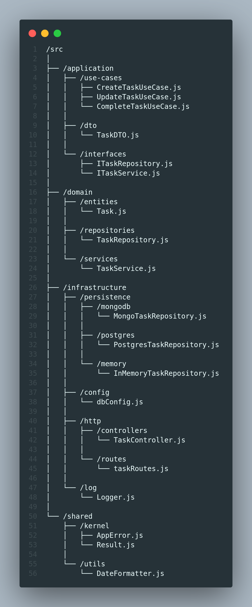

# DDD - Domain-Driven Design
O DDD (Domain-Driven Design) é uma abordagem ao desenvolvimento de software que foca na modelagem do domínio de negócios central e na tradução desse modelo em código. Quando aplicamos DDD em uma aplicação Node.js, a estrutura de pastas reflete as camadas e os componentes do domínio, separando bem as responsabilidades.

## Descrição das Pastas:
/src: Diretório raiz que contém todo o código-fonte da aplicação.  
/application: Esta camada contém a lógica de aplicação, ou seja, o que a aplicação faz. Não deve conter regras de negócio, apenas orquestra a execução dos casos de uso.  
/use-cases: Casos de uso que descrevem as ações que a aplicação pode realizar, como criar, atualizar ou completar uma tarefa.  
/dto: Objetos de transferência de dados (Data Transfer Objects) que servem para transportar dados entre diferentes partes da aplicação.  
/interfaces: Definições de interfaces, como repositórios e serviços, que os casos de uso irão consumir.  
/domain: Representa o domínio de negócio central e é a parte mais importante do DDD.  
/entities: Entidades do domínio, como Task, que representam objetos do mundo real ou conceitos de negócio.  
/repositories: Interfaces que definem como os dados devem ser persistidos ou recuperados, independentemente de qual banco de dados é usado.  
/services: Serviços de domínio que contêm lógica de negócio que não se encaixa perfeitamente em uma entidade.  
/infrastructure: Contém a infraestrutura que a aplicação necessita para funcionar, como persistência de dados, comunicação com outras APIs, etc.  
/persistence: Implementações específicas dos repositórios para diferentes bancos de dados, como MongoDB, PostgreSQL ou armazenamento em memória.  
/config: Configurações específicas da infraestrutura, como conexões de banco de dados. 
/http: Camada que lida com a comunicação HTTP, incluindo controladores que processam as requisições e rotas que mapeiam essas requisições para os controladores. 
/log: Serviço para gerenciamento de logs da aplicação. 
/shared: Contém código e utilitários compartilhados entre diferentes partes da aplicação. 
/kernel: Contém classes e funções essenciais para a aplicação, como tratamento de erros (AppError) e padronização de resultados (Result). 
/utils: Funções utilitárias que podem ser usadas em todo o projeto, como formatadores de data, geradores de UUID, etc. 

## Fluxo de Trabalho
O usuário envia uma requisição para criar uma tarefa. Essa requisição chega ao Controller na camada /infrastructure/http/controllers. 
O Controller chama um caso de uso específico da camada /application/use-cases. 
O caso de uso utiliza serviços de domínio e repositórios da camada /domain para executar a lógica de negócios e manipular as entidades. 
O caso de uso também pode chamar repositórios específicos da camada /infrastructure/persistence para persistir dados no banco de dados. 
Finalmente, a resposta é enviada de volta ao usuário via Controller. 
Essa estrutura promove uma separação clara de responsabilidades, facilita testes unitários e torna a aplicação mais escalável e mantível. 
